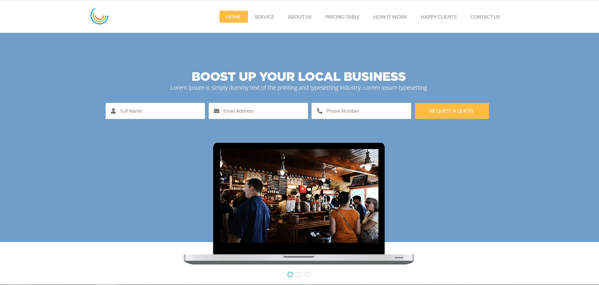

# Верстка простой странички со слайдером

[Демонстрация верстки](heknt90.github.io/free-business-layout/) |
[Ссылка на макет](https://drive.google.com/file/d/1yxGaBszocTJXdXBt_jhAjwIWpe3j-ZvO/view?usp=sharing/)

В процессе верстки использовались:

- HTML5;
- CSS3;
- JavaScript (для открытия гамбургер-меню и слайдера);
- БЭМ именование;
- Pixel Perfect для исходного разрешения экрана;
- Сервис по сжатию изображений;
- autoprefixer.

К сожалению в макете отсутствовали дизайны под другие разрешения экранов и мобильную версию пришлось адаптировать на свое усмотрение уже после выполнения Desktop-ной версии макета.
